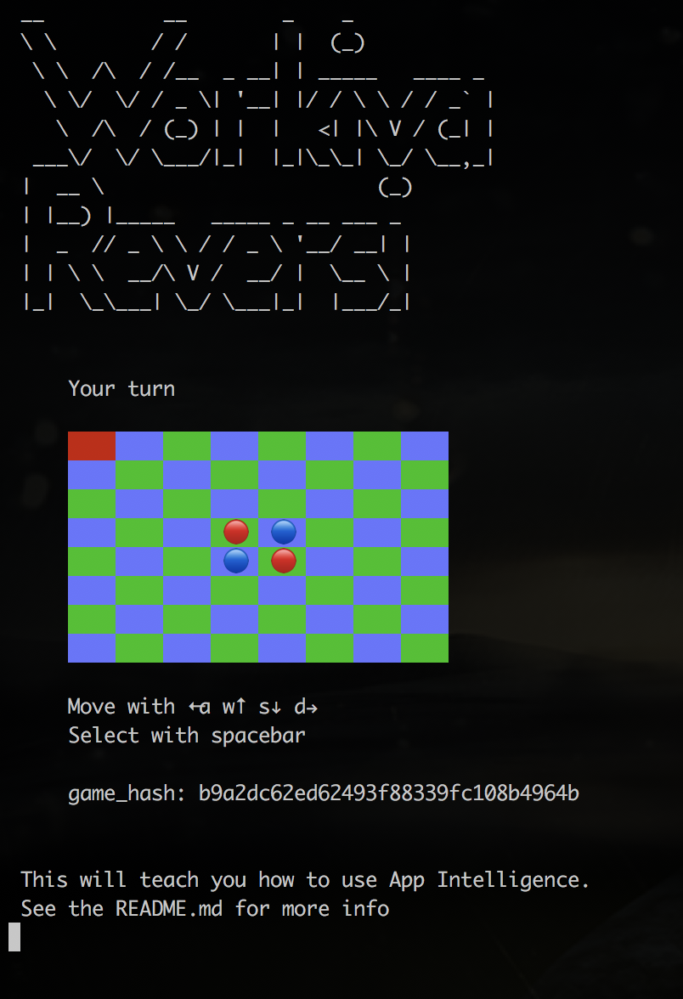
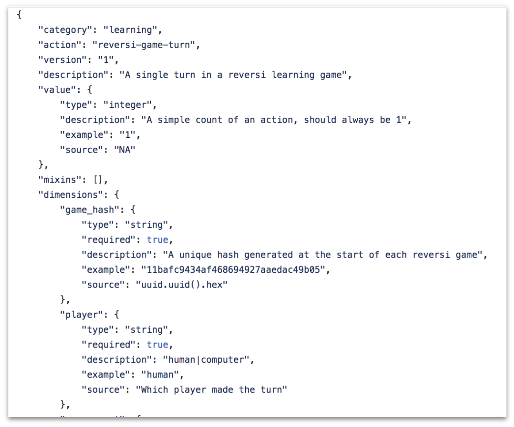
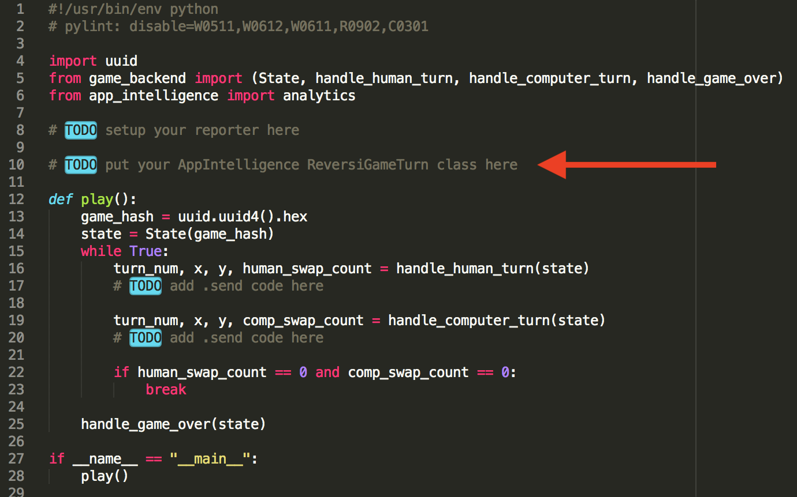
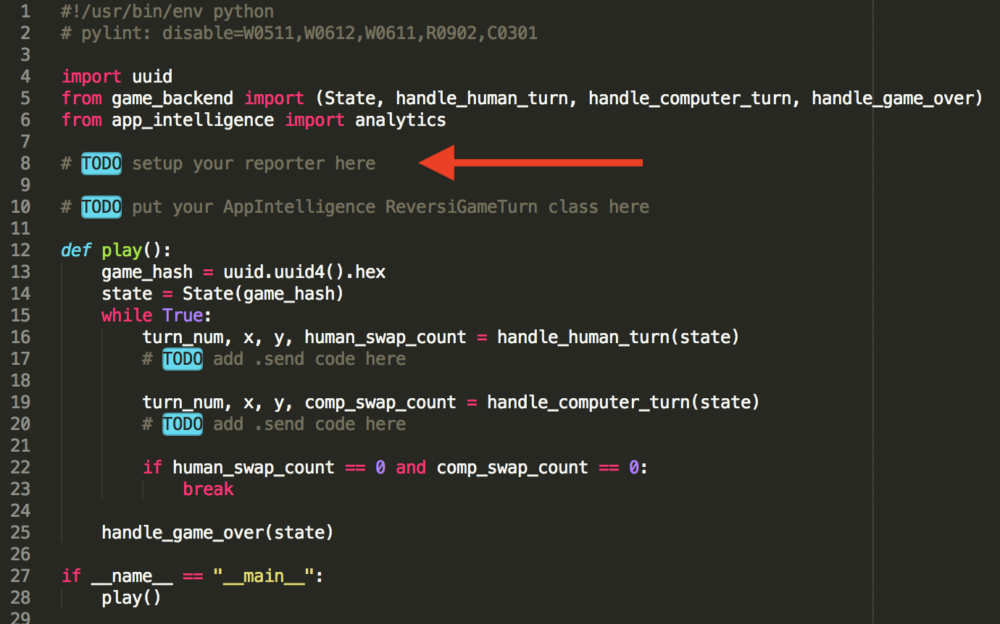
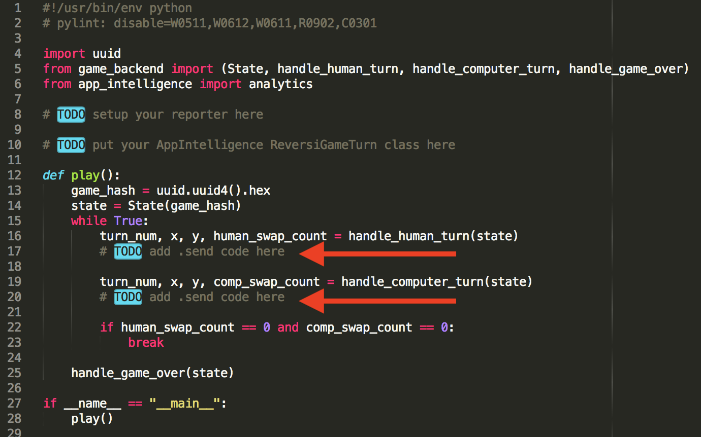
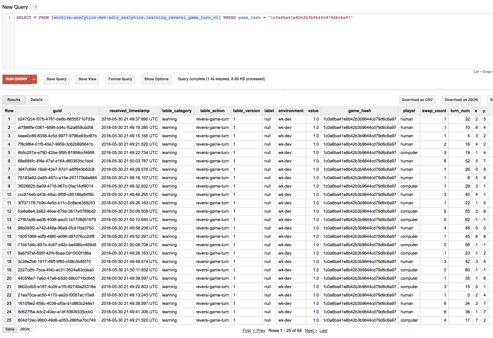

Workiva Reversi
===============

A tutorial of App Intelligence - Lunch and learn series
--------------------------------------------------------

Presentation here: https://docs.google.com/presentation/d/1SGaX-NAN6LPYKlxGdZrsihnuYbRzCCqBuPCU2P3cyfA

This tutorial will take you through the process for integrating app_intelligence in a python implementation of reversi. By the end, you'll have integrated a working analytics reporter into the reversi game which tracks the moves taken by yourself and the computer. You will then be able to track those moves in BigQuery.

 * [Setup](#setup)
 * [Integration](#integration)
 * [Final Code](#final-code)

## Setup

#### In terminal A

    sudo pip2 install virtualenvwrapper
    git clone https://github.com/Workiva/sdlc_analytics.git
    mkvirtualenv -p python2.7 sa
    cd sdlc_analytics
    pip2 install -r requirements_dev.txt
    make compile

#### In terminal B

    git clone https://github.com/scottrogowski-wk/reversi.git
    mkvirtualenv -p python2.7 reversi
    pip2 install app_intelligence

#### Once done in your reversi terminal (terminal B)

    cd reversi
    ./reversi.py

## Integration

 * [Step 1: Write an analytic](#step-1-write-an-analytic)
 * [Step 2: Generate analytic code](#step-2-generate-analytic-code)
 * [Step 3: Add AnalyticsReporter](#step-3-add-analyticsreporter)
 * [Step 4: Insert sender code](#step-4-insert-sender-code)
 * [Step 5: Run and view results in BigQuery](#step-5-run-and-view-results-in-bigquery)

### Step 1: Write an analytic

This is a a single JSON file in either the [user_analytics](https://github.com/Workiva/user_analytics) or the [sdlc_analytics](https://github.com/Workiva/sdlc_analytics) repo (In this case, sdlc_analytics). The easiest way to create a new analytic is to copy and modify an existing analytic. Once done, create a PR and ping us on "ANSERS Public" in Hipchat. For this tutorial, we will be using this analytic: https://github.com/Workiva/sdlc_analytics/blob/master/analytics/learning/learning_reversi-game-turn_v1.json

### Step 2: Generate analytic code

1. In sdlc_analytics terminal `make gen-py`
2. Open gen/python/analytics/learning_v1.py
3. Copy ReversiGameTurn to the top of reversi.py

### Step 3: Add AnalyticsReporter

At the top of reversi.py, add

    DEV = analytics.Hosts.SDLC_DEV
    reporter = analytics.AnalyticsReporter(DEV)

### Step 4: Insert sender code

    # Sending for the human

    reporter.send(ReversiGameTurn(
        turn_num=turn_num,
        x=x,
        y=y,
        swap_count=human_swap_count,

        game_hash=game_hash,
        player="human",

        value=1,
        ))

    # Sending for the computer

    reporter.send(ReversiGameTurn(
        turn_num=turn_num,
        x=x,
        y=y,
        swap_count=comp_swap_count,

        game_hash=game_hash,
        player="computer",

        value=1,
        ))

### Step 5: Run and view results in BigQuery

1. Play the game
2. Copy your game_hash
3. Go to this table https://bigquery.cloud.google.com/table/workiva-analytics:sdlc_analytics.learning_reversi_game_turn_v1
4. Query:

    SELECT *
    FROM [workiva-analytics-dev:sdlc_analytics.learning_reversi_game_turn_v1]
    WHERE game_hash = "YOUR_HASH"

## Final code

    #!/usr/bin/env python
    # pylint: disable=W0511,W0612,W0611,R0902,C0301

    import uuid
    from game_backend import (State, handle_human_turn, handle_computer_turn, handle_game_over)
    from app_intelligence import analytics

    DEV = analytics.Hosts.SDLC_DEV
    reporter = analytics.AnalyticsReporter(DEV)

    class ReversiGameTurn(object):
        """A single turn in a reversi learning game"""

        def __init__(self, value=None, swap_count=None, turn_num=None,
                     player=None, game_hash=None, y=None, x=None):
            """
            :param value: A simple count of an action, should always be 1
            :param swap_count: (integer) The number of pieces of the opposing player flipped on this turn
            :param turn_num: (integer) A simple turn count. Human players are even. Computer is odd
            :param player: (string) human|computer
            :param game_hash: (string) A unique hash generated at the start of each reversi game
            :param y: (integer) The y position where the piece was placed
            :param x: (integer) The x position where the piece was placed
            """
            self.guid = None
            self.category = 'learning'
            self.action = 'reversi-game-turn'
            self.version = '1'
            self.dimension_meta = {
                'swap_count': {
                    'type': 'integer',
                    'required': True,
                    'autofill': False
                },
                'turn_num': {
                    'type': 'integer',
                    'required': True,
                    'autofill': False
                },
                'player': {
                    'type': 'string',
                    'required': True,
                    'values': [
                        'human',
                        'computer',
                    ],
                    'autofill': False
                },
                'game_hash': {
                    'type': 'string',
                    'required': True,
                    'autofill': False
                },
                'y': {
                    'type': 'integer',
                    'required': True,
                    'autofill': False
                },
                'x': {
                    'type': 'integer',
                    'required': True,
                    'autofill': False
                },
            }

            self.mixins = [
            ]

            self.value_meta = {
                'type': 'integer'
            }

            self.value = value
            self.dimensions = {
                'swap_count': swap_count,
                'turn_num': turn_num,
                'player': player,
                'game_hash': game_hash,
                'y': y,
                'x': x,
            }

    def play():
        game_hash = uuid.uuid4().hex
        state = State(game_hash)
        while True:
            turn_num, x, y, human_swap_count = handle_human_turn(state)
            reporter.send(ReversiGameTurn(
                turn_num=turn_num,
                x=x,
                y=y,
                swap_count=human_swap_count,

                game_hash=game_hash,
                player="human",

                value=1,
                ))

            turn_num, x, y, comp_swap_count = handle_computer_turn(state)
            reporter.send(ReversiGameTurn(
                turn_num=turn_num,
                x=x,
                y=y,
                swap_count=comp_swap_count,

                game_hash=game_hash,
                player="computer",

                value=1,
                ))

            if human_swap_count == 0 and comp_swap_count == 0:
                break

        handle_game_over(state)

    if __name__ == "__main__":
        play()

