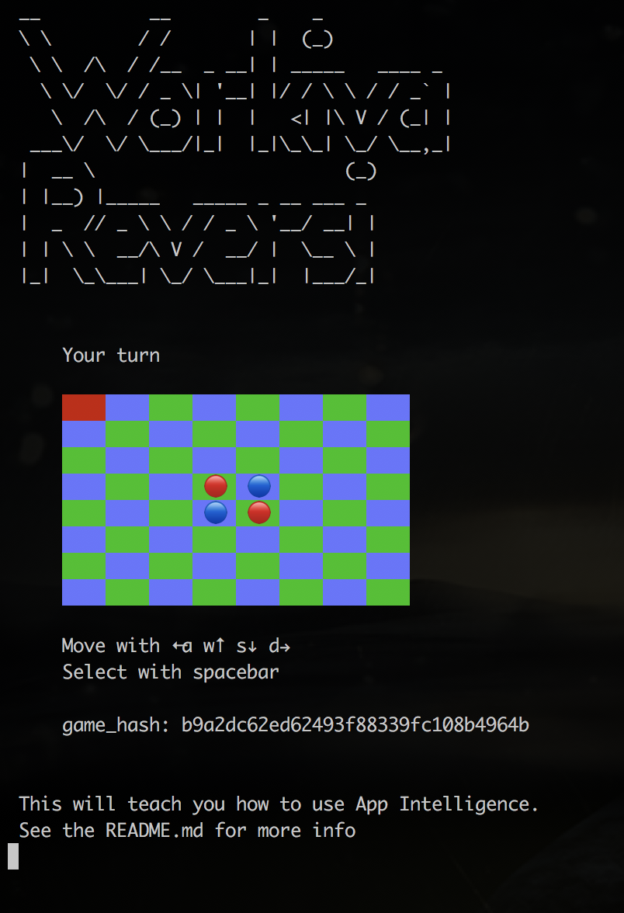

Workiva Reversi
===============

A tutorial of App Intelligence - Lunch and learn series
--------------------------------------------------------

Presentation here: https://docs.google.com/presentation/d/1SGaX-NAN6LPYKlxGdZrsihnuYbRzCCqBuPCU2P3cyfA

### Getting our environment setup

#### In terminal A

    sudo pip2 install virtualenvwrapper
    git clone https://github.com/Workiva/sdlc_analytics.git
    mkvirtualenv -p python2.7 sa
    cd sdlc_analytics
    pip2 install -r requirements_dev.txt
    make compile

#### In terminal B

    git clone https://github.com/scottrogowski-wk/reversi.git
    mkvirtualenv -p python2.7 reversi
    pip2 install app_intelligence

#### Once done in your reversi terminal (terminal B)

    cd reversi
    ./reversi.py

